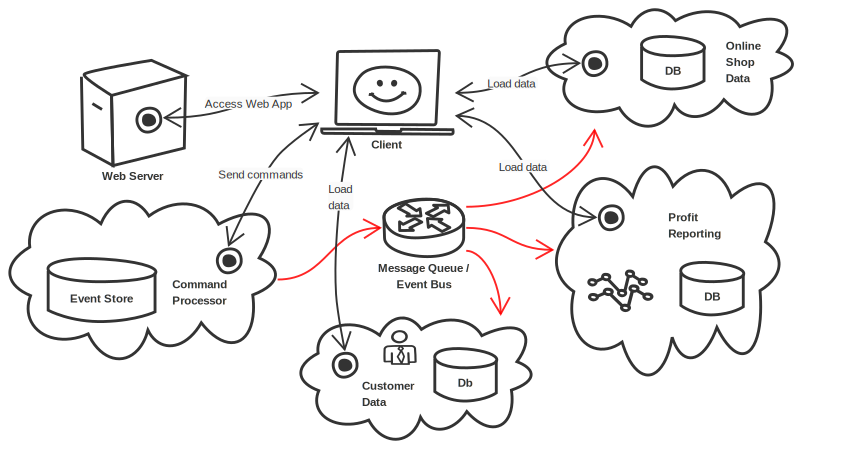
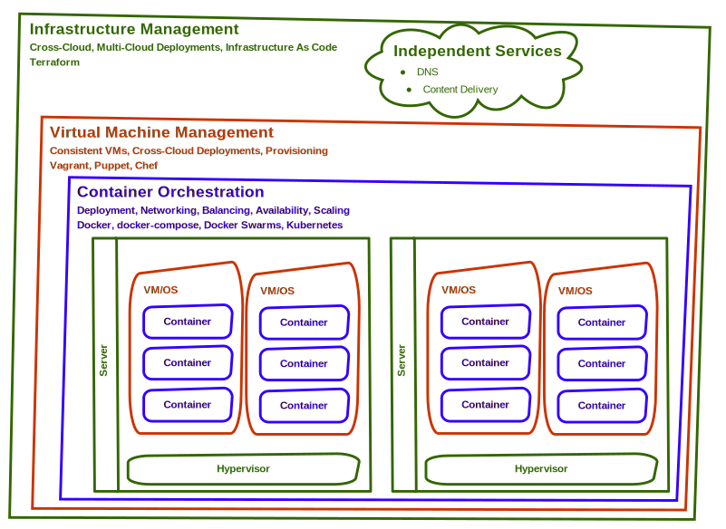
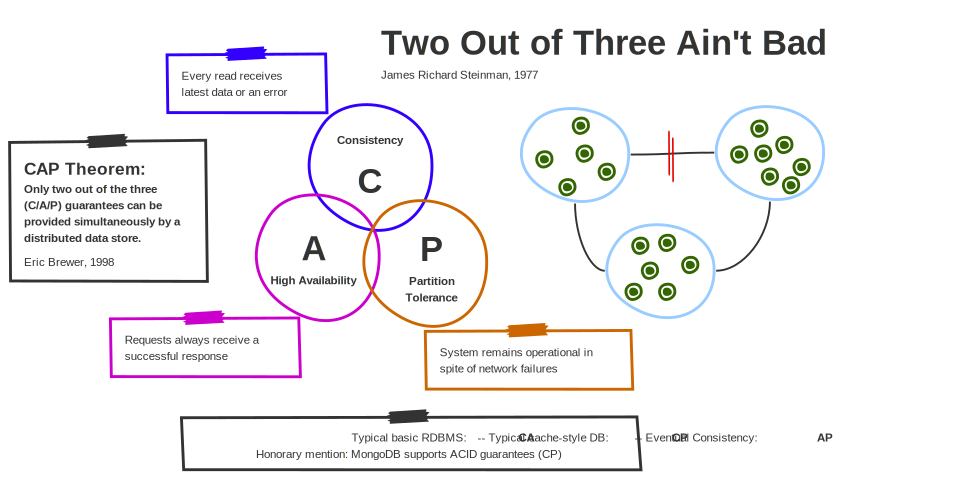

title: Entwickler und Architekten
subtitle: Strategien 2020
class: animation-fade
layout: true

<!-- This slide will serve as the base layout for all your slides -->

.bottom-bar[
{{title}}
]

---

class: impact

# {{title}}

## {{subtitle}}

.title-oli[
Oliver Sturm &bull; @olivers[@fosstodon.org] &bull; oliver@oliversturm.com
]

.title-logo[

]

---

## Oliver Sturm

- Training Director at DevExpress
- Consultant, trainer, author, software architect and developer for over 25 years

- Contact: oliver@oliversturm.com

---

## Agenda

Idee: Technologie diskutieren

Was sind Ihre Fragen? Diskussionspunkte?

---

class: columns-ul

## Anregungen

- Microservices, ja oder nein? Und wie?
- Cloud - muss das sein? Welche? Worauf kommt's an?
- Serverless - wird da nicht alles schwieriger?
- Container und VMs - Docker, Kubernetes, Vagrant, Terraform...
- Blazor? Ist das die Zukunft? Server mit SignalR oder Client mit WASM?
- Wie mache ich am besten Mobile?
- gRPC - Microsoft's neuer (?) Hype
- CQRS? Event Sourcing? Eventual Consistency? Moderne Datenzugriffspatterns
- React vs Vue vs Angular usw....
- TypeScript oder doch einfach JavaScript?
- Oliver Sturm's Best Practices Architekturmodell

---

class: columns-ul

## Fragen

- _noch keine_

---

## Dienststruktur

.svg-light[]

---

## CQRS und Event Sourcing

.svg-light[]

---

## Hypervisors

.svg-light-width[]

---

## Container und VMs

.svg-light[]

---

## CAP Theorem

.svg-light[]

---

## JavaScript vs TypeScript

.svg-light[]

---

## Sources

- This presentation:

  - https://oliversturm.github.io/developers-and-architects/basta-spring-2020
  - PDF download:  https://oliversturm.github.io/developers-and-architects/basta-spring-2020/slides.pdf

---

class: impact

# Thank You

Please feel free to contact me about the content anytime.

.title-oli[
Oliver Sturm &bull; @olivers[@fosstodon.org] &bull; oliver@oliversturm.com
]

.title-logo[

]
